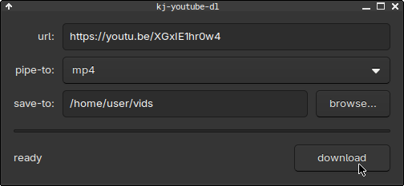

# kj-youtube-dl 📼



yup, yet another `youtube-dl`/`yt-dlp` GUI wrapper.

this is really just made for me, but if you find it useful, feel free to use it.

i use the following shell aliases/abbreviations when i thought i was a cool dude using a terminal all day 🙄:

```fish
abbr -a yt-best "youtube-dl -cif 'bestvideo+bestaudio/best'"
abbr -a yt-m4a "youtube-dl -cif 'bestaudio[ext=m4a]'"
abbr -a yt-mp4 "youtube-dl -cif 'bestvideo[ext=mp4]+bestaudio[ext=m4a]/best[ext=mp4]/best'"
abbr -a yt-mpv "mpv --ytdl-format="
abbr -a yt-webm "youtube-dl -cif 'bestvideo[ext=webm]+bestaudio[ext=webm]/best[ext=webm]/best'"
```

now i'm sad and lazy, so i made a gui that i can just set a keybind to and pop the app open 😬

## building

you need `gtk3` and `yt-dlp` installed (`mpv` if you want streaming support)

then just:

```sh
make
```

the binary will end up in `bin/kj-youtube-dl`

## using it

just run the binary:

```sh
./bin/kj-youtube-dl
```

paste a url, pick a format, click download. 

that's it

there's no magic here — it just runs `yt-dlp` with the options you pick.

the magic is with `yt-dlp` and other tools i'm wrapping against.

i'm not the talent, they are.

## what's here

- `src/main.c` - the entire app, probably badly written (i haven't written c since high school)
- `src/config.h` - compile-time configuration (colors, sizes, etc.), wasn't needed but maybe this will be cool someday
- `src/config.mk` - build configuration
- `Makefile` - standard suckless-style makefile

## license

check the LICENSE file, it's `0BSD` for the most part.